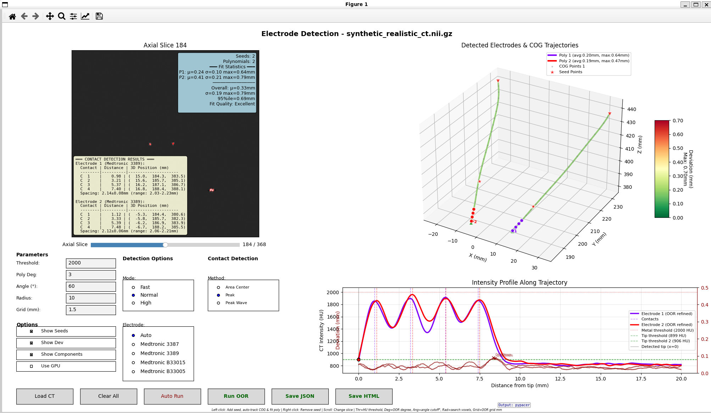

# PyPaCER

PyPaCER is a Python implementation for reconstructing deep brain stimulation (DBS) electrode positions and contact locations from post-operative CT imaging. This is a reimplementation of the original [MATLAB PaCER tool](https://github.com/adhusch/PaCER).

## Features

- Automatic detection of multiple DBS electrodes
- Sub-voxel precision electrode trajectory fitting
- Robust contact localization
- Support for Medtronic DBS electrodes (3387, 3389, B33015, B33005)
- GPU acceleration for faster processing
- Interactive GUI and command-line interfaces

## Installation

### Installation from Source

```bash
# Install directly from GitHub
pip install git+https://github.com/mvpetersen/pypacer.git

# Or clone and install locally
git clone https://github.com/mvpetersen/pypacer.git
cd pypacer
pip install .
```

### Development Installation

```bash
# Clone the repository
git clone https://github.com/mvpetersen/pypacer.git
cd pypacer

# Install in editable mode with uv (recommended)
uv pip install -e .

# Or with pip
pip install -e .

# Install with optional dependencies
uv pip install -e ".[gpu,gui,dev]"
```

## Quick Start

### Basic Usage

```python
from pypacer import PyPaCER

# Load CT image and detect electrodes (uses radial search by default)
pacer = PyPaCER('path/to/ct_image.nii.gz')
electrodes = pacer.detect_electrodes()

# Print contact positions
for i, electrode in enumerate(electrodes):
    print(f"Electrode {i+1}: {electrode.contact_positions}")
```

### Detection Methods

PyPaCER supports three methods for finding electrodes:

#### 1. Radial Search (Default - Recommended)
Most robust method that searches for metal artifacts at increasing distances from the brain center.

```python
# Default method - no brain mask required
pacer = PyPaCER('ct_image.nii.gz')
electrodes = pacer.detect_electrodes(
    detection_method='radial_search',  # This is the default
    search_radii_mm=[30, 40, 50]       # Search distances from center
)
```

#### 2. Automatic Brain Mask
Uses automated brain extraction followed by metal detection within the brain region.

```python
# Automatic brain mask extraction
pacer = PyPaCER('ct_image.nii.gz')
electrodes = pacer.detect_electrodes(
    detection_method='brain_mask_auto'
)
```

#### 3. Custom Brain Mask
Use a pre-computed brain mask for more control over the search region.

```python
# Provide your own brain mask
pacer = PyPaCER('ct_image.nii.gz', brain_mask='brain_mask.nii.gz')
electrodes = pacer.detect_electrodes(
    detection_method='brain_mask_custom'
)

# Or pass numpy array directly
import nibabel as nib
mask_img = nib.load('brain_mask.nii.gz')
mask_data = mask_img.get_fdata() > 0

pacer = PyPaCER('ct_image.nii.gz', brain_mask=mask_data)
electrodes = pacer.detect_electrodes(
    detection_method='brain_mask_custom'
)
```

### Detection Modes

PyPaCER provides three detection modes with different speed/quality trade-offs:

#### Fast Mode (5-10x faster)
Best for quick previews or testing.

```python
# Using the fast detection method
electrodes = pacer.detect_electrodes_fast()

# Equivalent parameters:
electrodes = pacer.detect_electrodes(
    xy_resolution=0.3,   # 3x coarser than default
    z_resolution=0.1,    # 4x coarser than default
    grid_size=1.0,       # Smaller search grid
    final_degree=3       # Lower polynomial degree
)
```

#### Normal Mode (Default)
Balanced speed and accuracy for most use cases.

```python
# Default detection
electrodes = pacer.detect_electrodes()

# Equivalent parameters:
electrodes = pacer.detect_electrodes(
    xy_resolution=0.1,   # Default resolution
    z_resolution=0.025,  # Default resolution
    grid_size=2.0,       # Default grid size
    final_degree=3       # Default polynomial degree
)
```

#### High Quality Mode
Maximum accuracy for publication-quality results.

```python
# High quality detection
electrodes = pacer.detect_electrodes(
    xy_resolution=0.05,  # 2x finer resolution
    z_resolution=0.01,   # 2.5x finer resolution
    grid_size=2.0,       # Standard grid size
    final_degree=3       # Standard polynomial degree
)
```


### GPU Acceleration

For faster processing with NVIDIA GPUs (speed up maybe be negligible pending on CPU/GPU hardware available):

```python
# Enable GPU acceleration
pacer = PyPaCER('ct_image.nii.gz', use_gpu=True)
electrodes = pacer.detect_electrodes()

```

### Advanced Parameters

```python
pacer = PyPaCER(
    'ct_image.nii.gz',
    metal_threshold=2000,    # HU threshold for metal detection
    brain_mask='mask.nii.gz' # Optional brain mask
)

electrodes = pacer.detect_electrodes(
    contact_detection_method='contactAreaCenter',  # Detection algorithm
    electrode_type='Medtronic 3389',               # Force specific type
    refinement_threshold=800,                      # Artifact refinement
    min_electrode_length_mm=40.0                   # Minimum length filter
)
```

### Electrode Types

Currently supported electrode models:
- **Medtronic 3387**: Standard quadripolar lead (1.5mm contact spacing)
- **Medtronic 3389**: Standard quadripolar lead (0.5mm contact spacing)
- **Medtronic B33015**: Sensight directional lead (1.5mm spacing)
- **Medtronic B33005**: Sensight directional lead (0.5mm spacing)

## Command Line Interface

PyPaCER provides two main CLI commands:

### CPU Processing
```bash
# Basic usage (results saved in same directory as CT)
pypacer /path/to/ct_image.nii.gz

# Fast mode
pypacer /path/to/ct_image.nii.gz --fast

# Use automatic brain mask extraction
pypacer /path/to/ct_image.nii.gz --brain-mask

# Use custom brain mask
pypacer /path/to/ct_image.nii.gz --brain-mask /path/to/mask.nii.gz

# Specify electrode type and output directory
pypacer /path/to/ct_image.nii.gz --electrode-type "Medtronic 3389" --output-dir results/
```

### GPU Processing
```bash
# Basic usage (saves to CT directory like CPU version)
pypacer-gpu /path/to/ct_image.nii.gz

# Specify output directory
pypacer-gpu /path/to/ct_image.nii.gz --output-dir results/

# With custom parameters
pypacer-gpu /path/to/ct_image.nii.gz --metal-threshold 1500 --electrode-type "Medtronic 3389"
```

### Report Generation
```bash
# Generate interactive HTML report from reconstruction results
pypacer-report reconstruction.json

# Specify output file
pypacer-report reconstruction.json --output report.html

# Exclude 3D visualization
pypacer-report reconstruction.json --no-3d
```

## Development Usage with uv

For development environments, you can run pypacer directly using `uv run` without installing it:

```bash
# Run the CLI with uv (CPU version - uses only core dependencies)
uv run pypacer /path/to/ct_image.nii.gz

# Run with fast mode
uv run pypacer /path/to/ct_image.nii.gz --fast

# Run GPU version (requires --extra gpu for PyTorch dependencies)
uv run --extra gpu pypacer-gpu /path/to/ct_image.nii.gz

# Run the GUI (requires --extra gui for PyQt5 dependencies)
uv run --extra gui pypacer-gui

# Run with multiple optional dependencies
uv run --extra gpu --extra gui --extra viz pypacer-gui
```

This approach is particularly useful when:
- Testing changes during development
- Running pypacer from a cloned repository
- Avoiding system-wide installation
- Managing dependencies automatically via pyproject.toml

**Note:** The GUI requires a graphical display environment. In headless environments (e.g., WSL without X server, remote SSH sessions), use the command-line interface instead.

## Troubleshooting

### No Electrodes Detected
- **Check metal threshold**: Try lowering to 1500-1800 HU for lower quality scans
- **Verify CT quality**: Best results require slice thickness ≤ 1mm
- **Check detection method**: Try different methods (radial_search is most robust)
- **Verify brain mask**: Ensure mask covers electrode region if using custom mask

### Poor Contact Detection
- **CT slice thickness**: Requires ≤ 1mm for reliable contact localization
- **Try different methods**: Test alternative contact detection methods
- **Check intensity profiles**: Use debug output to verify electrode visibility
- **Verify electrode type**: Ensure correct model is selected or use auto-detection

### GPU Acceleration Issues
- **CUDA not available**: Ensure NVIDIA drivers and CUDA toolkit are installed
- **Out of memory**: Reduce resolution parameters or use CPU mode
- **Version mismatch**: Check PyTorch CUDA version matches your CUDA installation

## GUI Application

Launch the interactive GUI:

```bash
pypacer-gui
```



The GUI provides:
- Interactive 3D visualization
- Manual electrode selection
- Real-time parameter adjustment
- Export to multiple formats

## Citation

If you use PyPaCER in your research, please cite both the software and the original PaCER paper:

### PyPaCER Software

```bibtex
@software{pypacer2025,
  author = {Petersen, Mikkel V.},
  title = {PyPaCER},
  year = {2025},
  url = {https://github.com/mvpetersen/pypacer},
  version = {1.0.0}
}
```

### Original PaCER Algorithm

```bibtex
@article{HUSCH201880,
  title = {PaCER - A fully automated method for electrode trajectory and contact reconstruction in deep brain stimulation},
  journal = {NeuroImage: Clinical},
  volume = {17},
  pages = {80-89},
  year = {2018},
  issn = {2213-1582},
  doi = {10.1016/j.nicl.2017.10.004},
  url = {https://www.sciencedirect.com/science/article/pii/S2213158217302450},
  author = {Andreas Husch and Mikkel V. Petersen and Peter Gemmar and Jorge Goncalves and Frank Hertel}
}
```

You can also import the citation metadata from [CITATION.cff](CITATION.cff).

## Contributing

Contributions are welcome! Please feel free to submit a Pull Request. For major changes, please open an issue first to discuss what you would like to change.


## License

This project is licensed under the MIT License - see the [LICENSE](LICENSE) file for details.

## Authors

- **Mikkel V. Petersen** - *Python implementation* - [@mvpetersen](https://github.com/mvpetersen)

## Acknowledgments

- **Original PaCER Algorithm**: Andreas Husch, Mikkel V. Petersen, Peter Gemmar, Jorge Goncalves, and Frank Hertel (2018). [NeuroImage: Clinical](https://doi.org/10.1016/j.nicl.2017.10.004)
